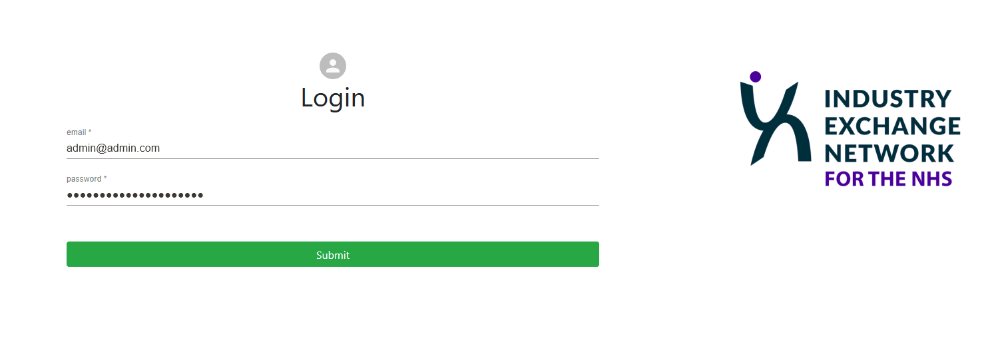
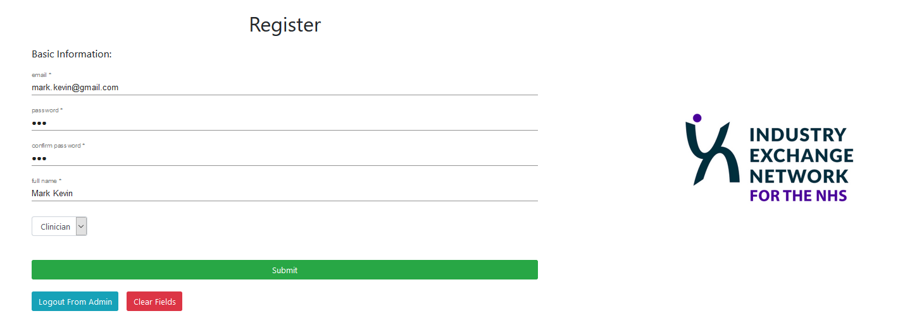
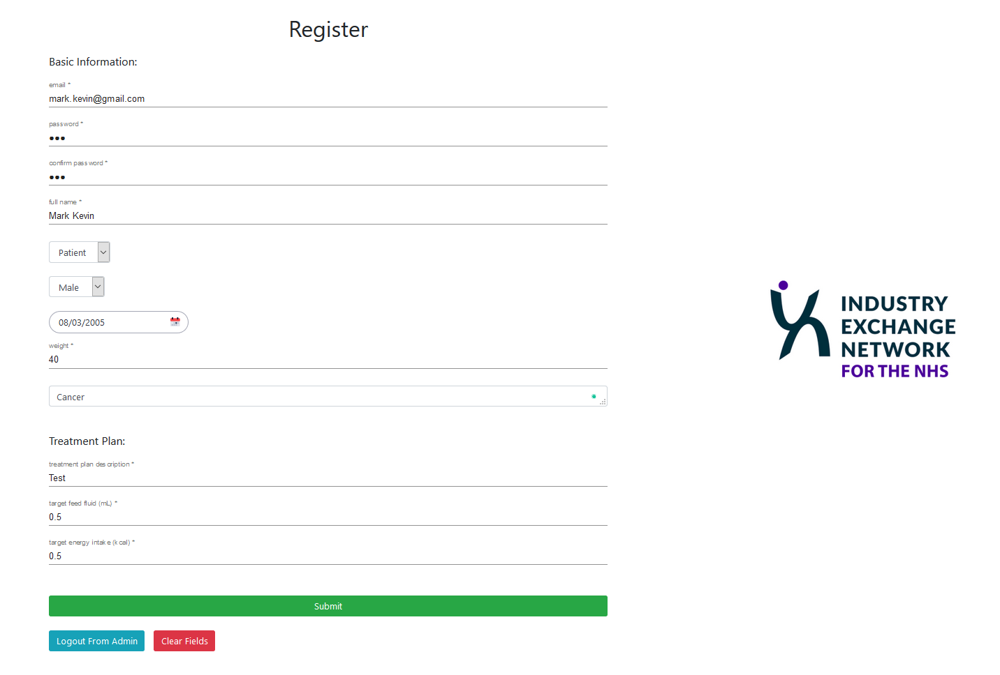

Since only authorised people can use the web app, it would be necessary that we need an `admin` user to register users.

## Login

There is only one valid admin user in this app, the user email is `admin@admin.com` and the password is `goshcomp0016team62021`.

## Register 

### Register Clinicians

On the `register` page, select your user role as `Clinician`. And then input your basic information: email, password, name one by one. All fields required.

### Register Patients

Similarly, admin user is also able to register a patient in this page. However, registering a patient requires more information including gender, date of birth to calculate age, diagnostic conclusion and initial treatment plan information.

