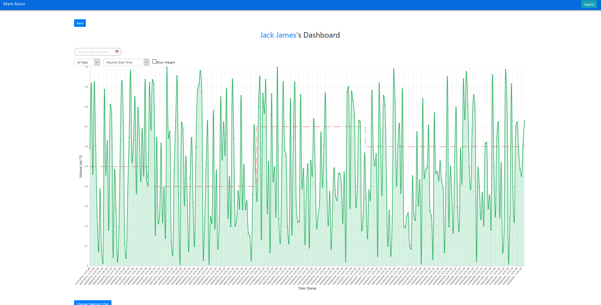
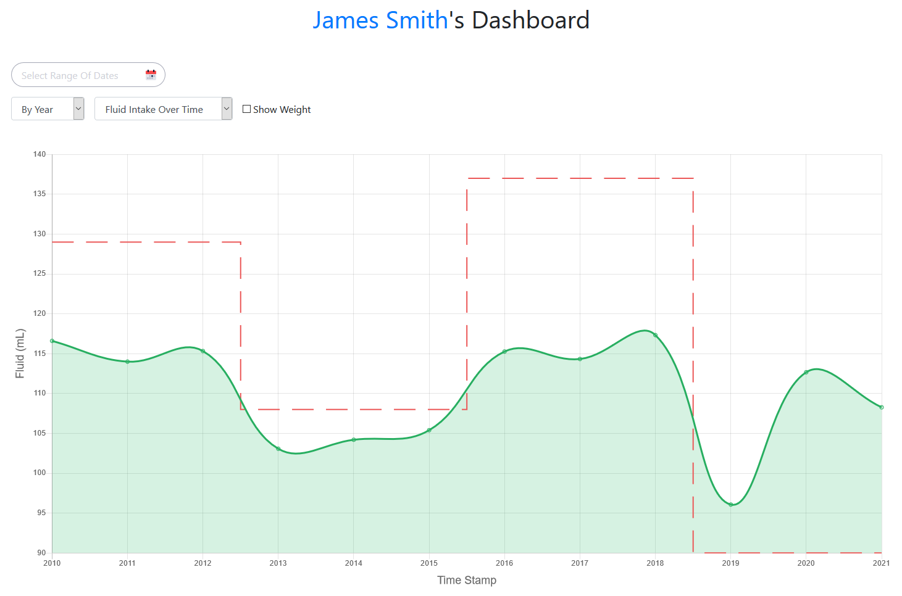
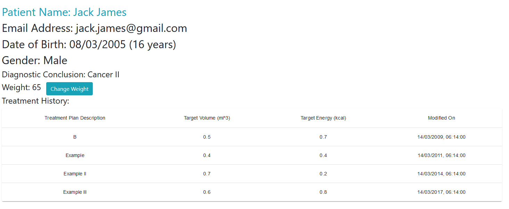

# Clinicians

## Login

If you have already register an account, just fill in email and password to input.

## Clinician Dashboard

### Add Patients

Since you just login, you haven't add any patients yet.

So, for now, you shall click the Add Patients button add some patients to supervise.

Once you enter the add patients page, you will see all patients stored in the database. If you find no patients under the search bar, don't worry. You need to register some before you move to the next step.

On both clinician dashboard page and add patients page, the form which is used to add patients contains only a component `SearchBar` and a button to submit the form.

#### Searching Patients

For the Searching bit, there is a search bar with text info `Search By Name`, after input the name of the patient, the system filter the lowercase of patients' names by the lowercase of input. If the name of the patient includes the input, this name will remain on the list.

.png)

#### Choosing Patients

And there are checkboxes for you to select the patients you want to add.

After submitting the form, you can click the `Back` button to return to the clinician dashboard page and you can access your patients' dashboards.

### Access to Patient Dashboard

The search bar is also available for the clinicians to search patients on the `Clinician Dashboard` page.

.png)

In addition, patients' names are in blue because each name links to their patient dashboard. 

## Patient Dashboard

This is the overall view of the patient dashboard of the clinician version. It consists of several different components.

### Filter the Data

#### Filter by Specific Date Range

The first component on the top left of the dashboard is used to select the date range to filter. 

.png)

.png)

After click on that and then select a range of time, the dashboard will filter the date the only remain the range of dates you selected.

#### Filter By Day, By Month or By Year

The default setting of filtering is `All Data`, change it to `By Day`, `By Month` or `By Year` to reset the dashboard.

### Data Type

Our web app dashboard supports two types of data type: `Fluid Intake Over Time` and `Energy Intake Over Time`, the default setting is `Fluid Intake Over Time`, change the selection to the second one to check the patient's energy intake over time.

#### Fluid Intake Over Time

#### Energy Intake Over Time

### Show Weight

If tick the checkbox `Show Weight`, the dashboard will display the change of patient's body weight changes over time in a blue line on a new graph.

### Patient Feedback

Just hover on the point of the graph to see the percentage difference of received and target feed and click on it to give the clinician timely feedback at the specific time. In the future, the feedbacks are significant evidence to make new treatments plans.

### Change Treatment Plan

At the bottom of the page, there is a button for the clinicians to change a new treatment for their patients.

All three text fields must fill in. Besides, the Target Feed Volume and Target Energy Intake have to greater than 0. Otherwise, the input is invalid.

The new personalised treatment will be kept in the database and be able to review on the patient info page.

### Access to Patient Information

Similar to the counterpart of the clinician dashboard, the name in blue indicates that it links to a new page, `patient info`.  

## Patient Information

### Browse Information

This page displays all patients information including name, email, date of birth, age, gender, diagnostic conclusion, weight and treatment history.

Both clinicians and patients can check all treatment plans since the patient received medical care in the treatments history bit.

### Change Weight

On the `Patient Info` page, change weight is also allowed. Click on the `Change Weight` button, input a natural number, submit it.

.png)

.png)