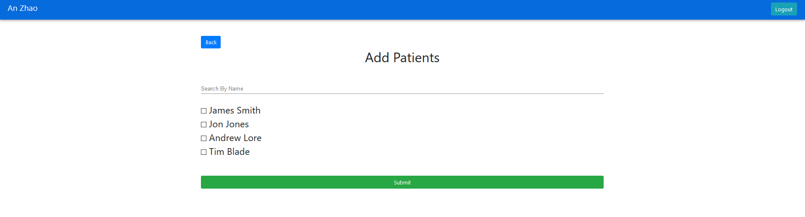
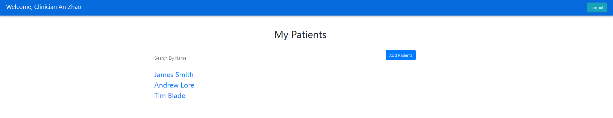
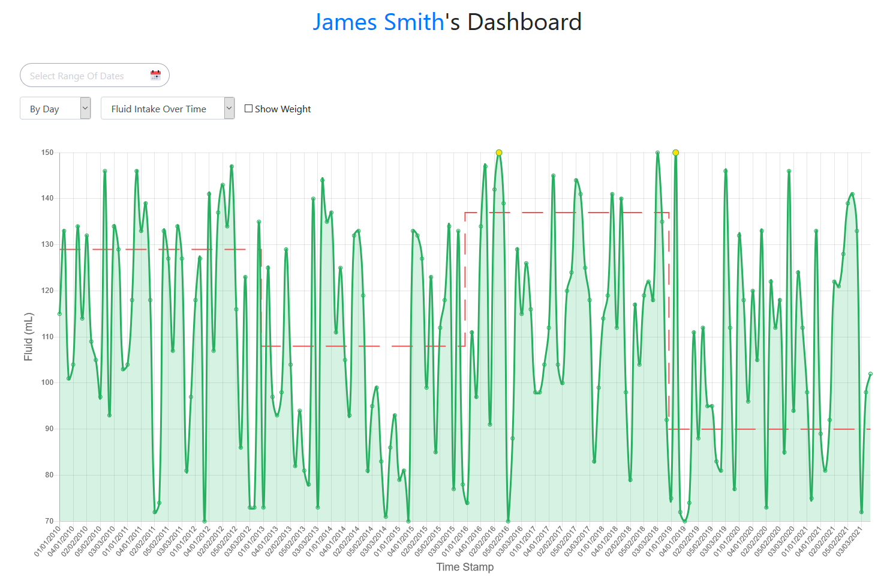

# Clinicians

## Login

Enter the credentials of your registered clinician account. 

## Clinician Dashboard

### Add Patients

With a fresh clinician account, there will be no assigned patients in your list. 

In order to add supervised patients to your list, you shall click the Add Patients button. 

Once you enter the add patients page, you will see all patients stored in the database. 

#### Searching Patients

There will be a search bar on both the clinician dashboard page and add patients page, searching by the name of the patient. 

Type in the name that you wish to search for, then if the name of the patient matches your input, the patient will be showing up on the list. 

.png)

#### Choosing Patients

Tick the checkboxes next to the names and submit them to add patients to your clinician dashboard. You can also uncheck the boxes to remove patients that you are not supervising anymore. 

After submitting the form, there should be a successful message, then you can click the `Back` button to return to the clinician dashboard page and you can access your patients' dashboards. 

### Access to Patient Dashboard

The search bar is also available for the clinicians to search patients on the clinician dashboard page. 

.png)

The patients' names are clickable which redirects to their patient dashboard. 

## Patient Dashboard

This is the overall view of the patient dashboard of the clinician version. It consists of several different components. 

### Filter the Data

#### Filter by Specific Date Range

The component on the top left of the dashboard is used to select the date range to filter. 

.png)

.png)

By selecting a start date and an end date, the dashboard will filter the data only within the date range you selected. 

#### Filter By Day, By Month or By Year

The default setting of filtering is `All Data`, change it to `By Day`, `By Month` or `By Year` according to your preference. 

### Data Type

Our web app dashboard supports two types of data type: `Fluid Intake Over Time` and `Energy Intake Over Time`. The default setting is `Fluid Intake Over Time`, you can change to the energy intake graph by using the dropdown. 

#### Fluid Intake Over Time

#### Energy Intake Over Time

### Show Weight

To display the weight graph, tick the `Show Weight` box. A separate weight against time graph will be shown in the blue line below the original graph. 

### Patient Feedback

Hover on the point of the graph to see the percentage difference of received and target feed and click on it to give the clinician feedback at the specific time. In the future, the feedbacks can be helpful to make better-suited treatment plans for patients. 

### Change Treatment Plan

At the bottom of the page, there is a button for the clinicians to change the treatment plan for their patients. 

All three text fields are required. The target volume and target energy should also be greater than 0 for the input to be valid. 

The new treatment will be kept in the database and be able to review the patient info page. 

### Access to Patient Information

The name in blue indicates the link to the patient info page. 

## Patient Information

### Browse Information

This page displays all patient’s information including name, email, date of birth, age, gender, diagnostic conclusion, weight and treatment history. These data will be accessible by both the clinician and the patient. 

### Change Weight

On the `Patient Info` page, you can also update the patient's weight by clicking on the `Change Weight` button. Submit a positive number to update the new weight of the patient. 

.png)

.png)