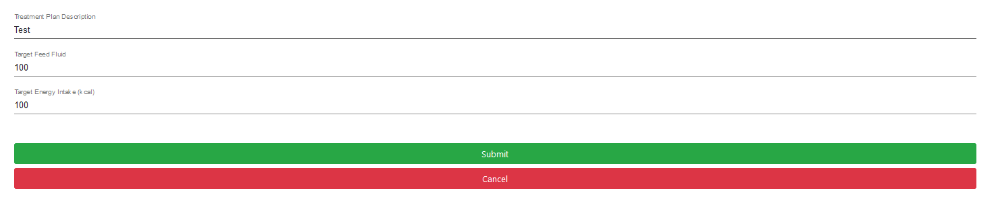

# Getting Started

This is the guide for UCL-GOSH Data Interchange for Sensors Classifications application. 

Our app provides users with visualisation of feeding pump data with a dashboard and also storing these data for observations by clinicians. 

The following are some guides on getting familiar with the app: 

-         Register a user 

-         Give feedback as a patient 

-         Add patients as a clinician 

-         Change the treatment plan as a clinician 

## Register a user 

To use the app, you will need to first register as a user. After login the user role as `admin`, the user is able to register other clinicians and patients.

Here, you will be able to see the form that needs to be filled in. There is also a field to choose to register as either a patient or a clinician. Depending on the role, the details required will be different. Clinicians only need email, name and password, while patients will further require their date of birth, weight, gender diagnostic conclusion and the treatment plan detail. You may then click on the `submit` button to register, and if everything is filled in correctly, you will be now logged in and redirected to the `Dashboard` page. 

## Give feedback as patient 

A patient can leave comments on the specific points on the graph clarifying what has happened. On the patient’s `dashboard` page, there will be data points on the graph. 

You can click on the point that you want to comment on and there will be a popup prompting you to enter your explanation. 

Click `submit` and your feedback will now be visible when having on that specific point. 

 

## Add patients as a clinician 

On the clinician’s main page (the first page after you logged in as a clinician), click the `Add Patient` button. 

You should now see the list of all patients that are registered. Click on the checkboxes to add the patient that you are monitoring or uncheck the ones that you are not. You can also find specific patients by typing their names on the search bar. Then click `Submit` button when you are done and updates will be saved. You can see the new list of patients by clicking the `Back` button. 

 

## Change treatment plan as a clinician 

When you are reviewing a patient’s data as a clinician, you may wish to alter their current treatment plan, i.e., feeding rate, energy intake rate. You can click on the `Change Treatment Plan` button on the bottom of the `Dashboard` page. 

You will be presented with a form to fill in the new treatment plan. Once the form is submitted by clicking the `Submit` button, the new treatment plan will be updated onto the dashboard graph. 