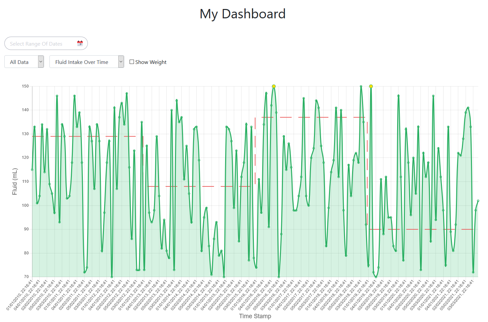
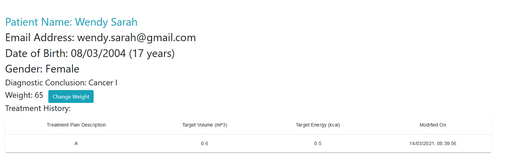

# Patients

A patient user will have most of the dashboard functionalities similar to a clinician. Patients will only be able to access their treatment data. 

## Login

Enter the credentials of your registered patient account. 

## Patient Dashboard

This is the patient dashboard which consists of several different components. 

### Filter the Data

#### Filter by Specific Date Range

The component on the top left of the dashboard is used to select the date range to filter. 

.png)

.png)

By selecting a start date and an end date, the dashboard will filter the data only within the date range you selected. 

#### Filter By Day, By Month or By Year

The default setting of filtering is `All Data`, change it to `By Day`, `By Month` or `By Year` according to your preference. 

### Data Type

Our web app dashboard supports two types of data type: `Fluid Intake Over Time` and `Energy Intake Over Time`. The default setting is `Fluid Intake Over Time`, you can change to the energy intake graph by using the dropdown.

#### Fluid Intake Over Time

#### Energy Intake Over Time

### Show Weight

To display the weight graph, tick the `Show Weight` box. A separate weight against time graph will be shown in the blue line below the original graph. 

### Patient Feedback

Hover on the point of the graph to see the percentage difference of received and target feed and click on it to give the clinician feedback at the specific time. In the future, the feedbacks can be helpful to make better-suited treatment plans for patients. 

### Access to Patient Information

On the top left of the patient dashboard, there is a `My Information` link to the patient info page.

## Patient Information

### Browse Information

This page displays all patient’s information including name, email, date of birth, age, gender, diagnostic conclusion, weight and treatment history. These data will be accessible by both the clinician and the patient. 

### Change Weight

On the `Patient Info` page, you can also update the patient's weight by clicking on the `Change Weight` button. Submit a positive number to update the new weight of the patient. 

.png)

.png)