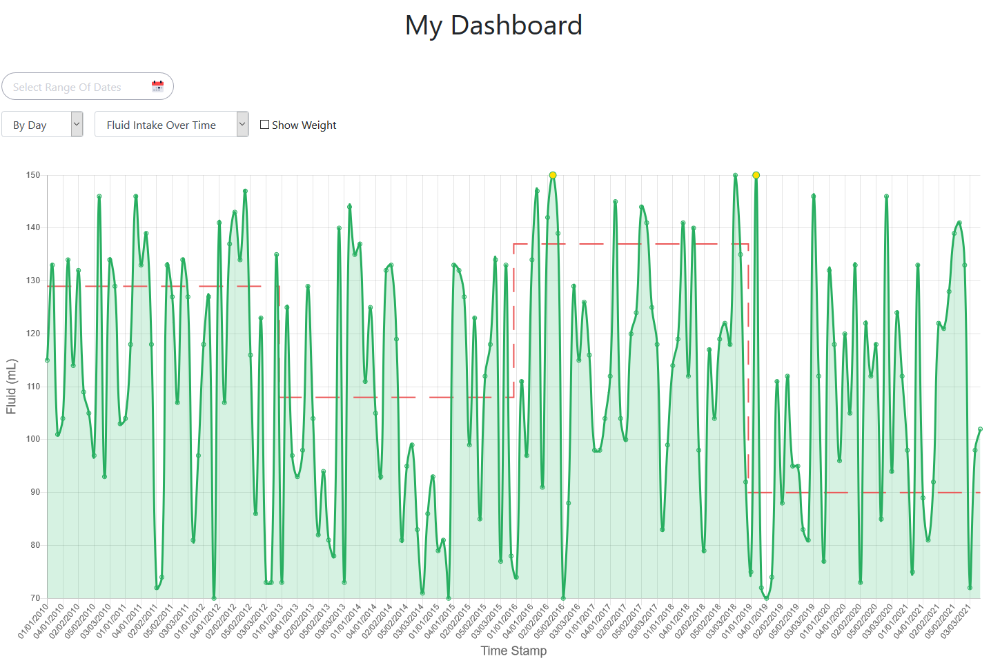
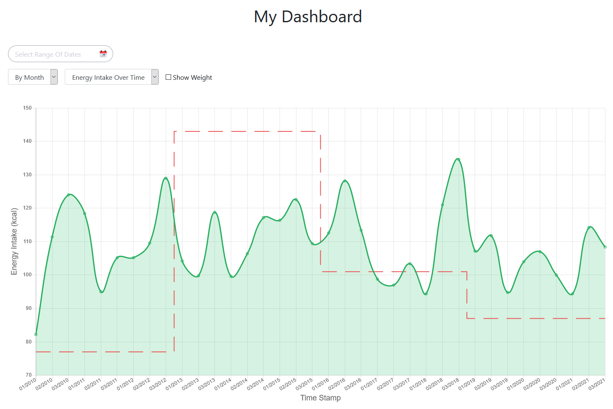

# Patients

First of all, I have to mention here, the web app of the patient version is almost the same as that of the clinician's version in functionalities apart from some features such as add patients, but it mainly focuses on browsing the patient's himself dashboard and information rather than checking other patients or changing important treatment plans.

## Register

Similar to the clinician's version, the register page also needs basic information. However, this page requires more information including gender, date of birth to calculate age, diagnostic conclusion provided by clinicians, initial treatment plan information.

Please pay attention to fill in these fields according to common sense, for example, weight must be greater than 0 and should not be a string.

Click the `Submit`, and then login as a patient.

## Login

If you have already register an account, just fill in email and password to input.

## Patient Dashboard

This is the overall view of the patient dashboard of the clinician version. It consists of several different components.

### Filter the Data

#### Filter by Specific Date Range

The first component on the top left of the dashboard is used to select the date range to filter. 

After click on that and then select a range of time, the dashboard will filter the date the only remain the range of dates you selected.

.png)

#### Filter By Day, By Month or By Year

The default setting of filtering is `All Data`, change it to `By Day`, `By Month` or `By Year` to reset the dashboard.

### Data Type

Our web app dashboard supports two types of data type: `Volume Over Time` and `Energy Intake Over Time`, the default setting is `Volume Over Time`, change the selection to the second one to check the patient's energy intake over time.

#### Volume Over Time

#### Energy Intake Over Time

### Show Weight

If tick the checkbox `Show Weight`, the dashboard will display the change of patient's body weight changes over time in a blue line.

### Patient Feedback

Just hover on the point of the graph to see the percentage difference of received and target feed and click on it to give the clinician timely feedback at the specific time. In the future, the feedbacks are significant evidence to make new treatments plans.

### Access to Patient Info

Similar to the counterpart of the clinician dashboard, the name in blue indicates that it links to a new page, `patient info`.  

## Patient Info

### Browse Information

This page displays all patients information including name, email, date of birth, age, gender, diagnostic conclusion, weight and treatment history.

Both clinicians and patients can check all treatment plans since the patient received medical care in the treatments history bit.

### Change Weight

On the `Patient Info` page, change weight is also allowed. Click on the `Change Weight button`, input a natural number, submit it.

.png)

.png)